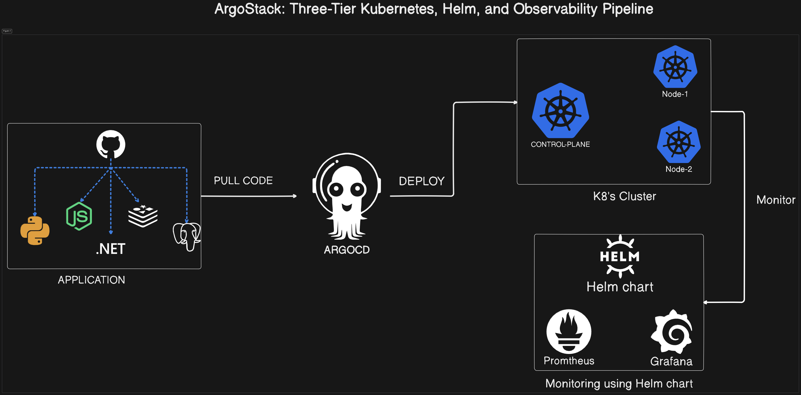
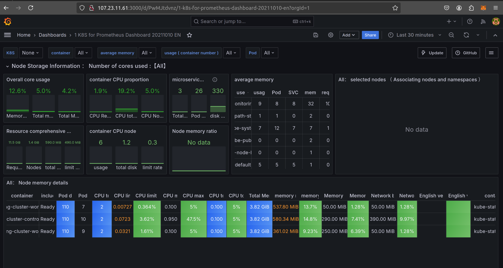
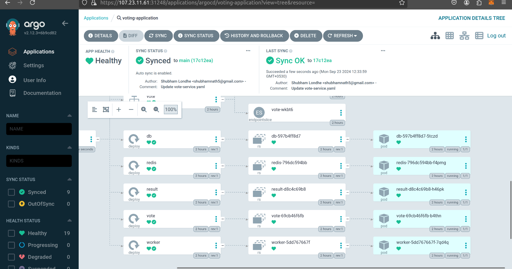
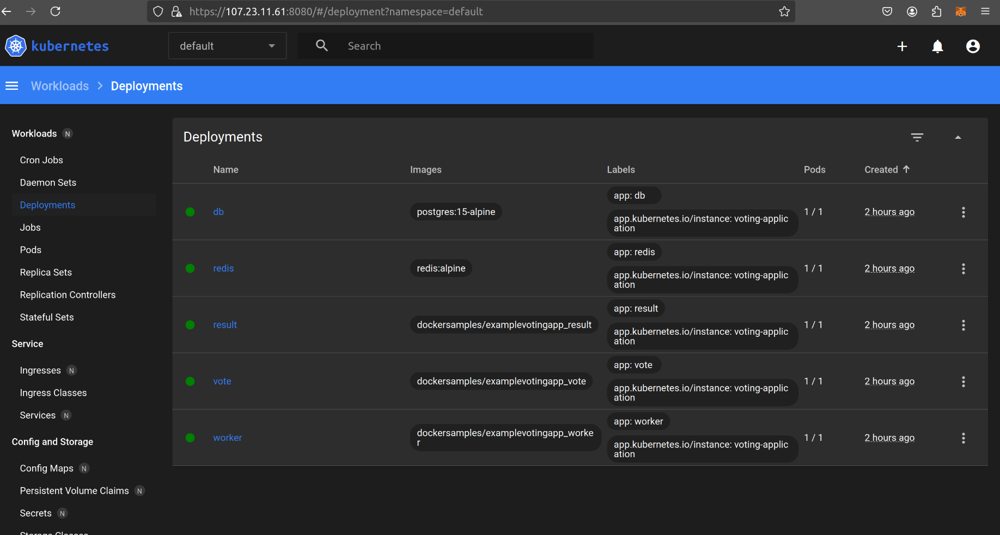
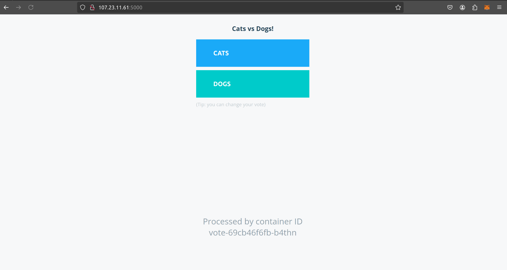

# ArgoStack-Three-Tier-Kubernetes-Helm-and-Observability-Pipeline
A comprehensive guide for setting up a Kubernetes cluster using Kind on an AWS EC2 instance, installing and configuring Argo CD, and deploying applications using Argo CD.

# Overview :

:point_right:  Launch an AWS EC2 instance.  
:point_right:  Install Docker and Kind.  
:point_right:  Create a Kubernetes cluster using Kind.  
:point_right:  Install and access kubectl.  
:point_right:  Set up the Kubernetes Dashboard.  
:point_right:  Install and configure Argo CD.  
:point_right:  Connect and manage your Kubernetes cluster with Argo CD.

# Architecture Diagram:

## Observability:

## ArgoCD:

## Kubernetes Dashboard:

## Application:

Full Implementation is here : https://prithg.hashnode.dev/argostack-three-tier-kubernetes-helm-and-observability-pipeline
